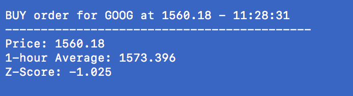
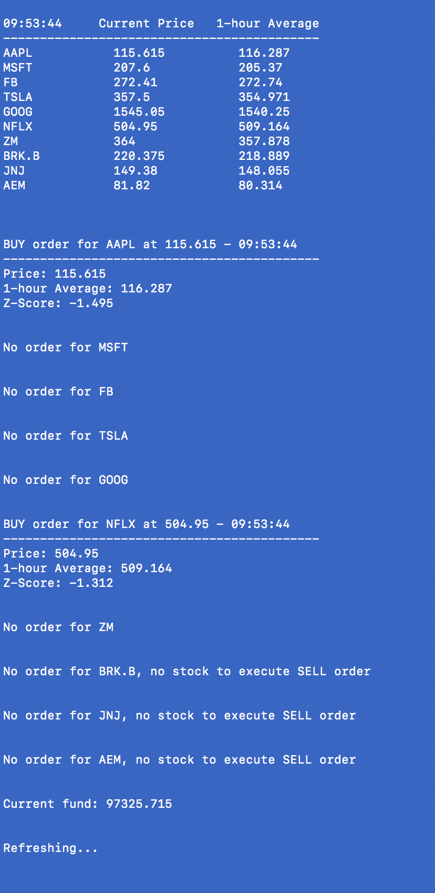

# Simple Mean Reversion Trading Program

*Kerem San* 
  

An automated trading bot that trades a small portfolio of ten stocks using a simple mean reversion trading algorithm.

**Disclaimer:** This program is not a fully developed trading bot that 
promises or attempts to generate positive returns every single trading 
session. The sole purpose of this program is for me to get practice 
translating a simple trading strategy into code and gain experience 
with algorithmic trading.

API: Alpaca Paper Trading API

## The Portfolio
- AAPL (Apple Inc)
- MSFT (Microsoft Corporation)
- FB (Facebook, Inc.)
- TSLA (Tesla Inc)
- GOOG (Alphabet Inc)
- NFLX (Netlix Inc)
- ZM (Zoom Video Communications Inc)
- BRK.B (Berkshire Hathaway Inc)
- COST (Costco Wholesale Corporation)
- AEM (Agnico Eagle Mines Ltd)

These stocks were picked from different industries to diversify the portfolio
and also picked based on volatility and volume, making them good candidates for
the mean reversion algorithm.

## The Algorithm

For each stock in the portfolio;
- Gets current stock price each minute
- Updates 1-hour moving average of the stock each minute
- Compares current price to moving average by computing z-score.
- If the z-score is greater than 1, meaning that the current price is above
  the moving average by at least one standard deviation, executes a SELL order
- If the z-score is smaller than -1, meaning that the current price is below
  the moving average by at least one standard deviation, executes a BUY order

Other Features:
- Keeps track of all the buy prices of the stocks so that the algorithm cannot 
wrongfully sell a stock at a lower price than it has been bought
- If the next BUY order will decrease the starting fund by 25%, does not execute
the order or any other BUY orders until the fund increases again, and prints an 
appropriate message
- If there is only 30 minutes left for the stock market to close, does not execute
any new BUY orders
- If the z-score of a stock is greater than 1, but the stock is not in possesion, 
i.e. if there is no stock to sell, does not execute a SELL order and prints an 
appropriate message

## The Program

**Initial screen when the stock market is open prints the portfolio and the starting fund:**
  

  

**When the stock market is closed, prints the message below and exits the program:**
  

  

**An example price table that gets printed and updated each minute:**
  

  

**An example BUY order output:**
  

  

**An example SELL order output:**
  

  

**An example screen that the user views each minute:**
  

